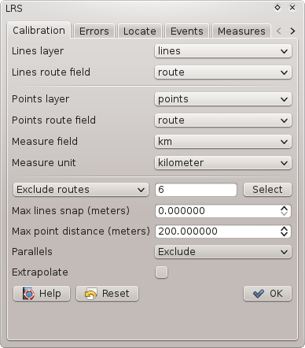

.. lrsplugin documentation master file
   

LRS Plugin for QGIS
*******************

.. toctree::
   :maxdepth: 2

.. image:: ../build/icon.png
   :align: left
   
"Linear referencing (also called linear reference system or linear referencing system or LRS), is a method of spatial referencing, in which the locations of features are described in terms of measurements along a linear element, from a defined starting point, for example a milestone along a road." (`Linear referencing <http://en.wikipedia.org/wiki/Linear_Reference_System>`_, Wikipedia, 2013).   

Introduction
============

The plugin was developped for *Il Servizio Gestione Strade* della `Provincia Autonoma di Trento. <http://www.provincia.tn.it/>`_

Motivation
..........

The biggest problem of LRS is consistency and quality of data. This is caused by the fact that line and point data are maintained separately, sometimes even by different entities. Identification and correction of errors in LRS is tedious and inefficient without specialized tools. The true value of this plugin is in its support for errors identification, navigation and correction.

Features
........

* Standard LRS tasks: calibration (creation of LRS), creation of punctual and linear events and calculation of measures for points.
* Support for all vector formats supported by QGIS.
* Supported are lines, multi-lines, points, multi-points. The lines don't need to be oriented. Single route may be represented by multiple features.
* **Dynamic** list and layer of errors and layer of quality which are **updated immediately** when source layer features is edited.
* The generated LRS is stored in memory only.
* Interpolation between points by default, optional extrapolation.

.. raw:: html

   <iframe width="560" height="315" src="http://www.youtube.com/embed/3BmUIAQRc0g" frameborder="0" allowfullscreen></iframe>

Terminology
...........

* **route** is linear feature represented by one or more line features with the same identifier, e.g. road with the same road number or river with the same name.
* **route id** is unique route identifier
* **measure** is real world measure along linear feature, e.g. kilometers measured along road from its beginning which may be represented in real world by milestones.

Calibration
===========

The calibration is a process in which:

* route elements are joined into route parts 
* points are attached to routes by route id
* routes orientation is guessed from point measures
* table of calibration records is created for each route parts
* it is generated the list of errors

The calibration is launched from the first tab *Calibrate*:

   
Options:

* **Lines layer:** Layer with lines representing routes. It may contain lines and multi-lines. A single route may be represented by multiple features. Lines do not have to be oriented.
* **Lines route field:** Route id field in lines layer. All field types are supported (including floats) but reasonable types, i.e. string or integer are recommended.
* **Points layer:** Layer with points. It may contain points and multi-points (multi-points make no sense in LRS however).
* **Points route field:** Route id field in points layer. The field type may be string or integer.
* **Measure field:** Measure field in points layer. All field types are supported (including floats) but reasonable types, i.e. string or integer are recommended. The type of field does not need to match route id field type in line layer, see general notes.
* **Measure unit:** Measure field values units.
* **All/include/exclude routes:** Calibration may be done on all routes, selected routes or some routes may be excluded. Included/excluded routes can be either entered in following field as comma separated list or selected from list in dialog opened by *Select* button. The list in the dialog is filled by route id values from lines layer.
* **Max lines snap:** Maximum gap between route lines to be snapped.
* **Max point distance:** Maximum distance of point from route to be used.
* **Parallels:** Because `paralles <http://en.wikipedia.org/wiki/Multiple_edges>`_ (multiple edges, parallel edges), typicaly `roundabouts <http://en.wikipedia.org/wiki/Roundabout>`_ would become ambiguous in LRS they must be treated in special way. There are three options:
  
  * **Mark as errors:** Parallels will be added to the list of errors and excluded from calibration.
  * **Span by straight line:** Parallel lines will be replaced by straight line going from parallels start coordinate to end coordinate.
  * **Exclude:** Paralles will be excluded from callibration without being marked as errors.
  
* **Extrapolate:** If checked, measures are extrapolated before first and after last point on route part. Otherwise segments before/after first/last point are not calibrated.

When all oprions are set correctly, calibration may be launched by *OK* button. The process may take a while, progress bar with status label is indicating current state. When calibration is finished all tabs are enabled and LRS may be used or edited.

Measures are always interpolated between two poins. This may be made optional in future but currently we don't see any usecase where non inperpolating could give better results. If you know any, please create a `new issue <https://github.com/blazek/lrs/issues/new>`_.

The generated LRS is not stored in a new output layer but it is kept in memory and it can be used immediately to generate events or acquire measures. This may change in future but currently QGIS vector core API does not support measure value in vector geometry. We hope that rebuilding the LRS when needed should not be disturbing because all options are stored in project for the case when a task has to be repeated and calibration is *relatively* fast.

The LRS plugin in QGIS works similarly as ArcGIS CalibrateRoutes_lr() with parameters calibrate_method=DISTANCE, search_radius=<**Max distance**> and interpolate_between=BETWEEN. If **Extrapolate** is checked it means plus parameters extrapolate_before=BEFORE and extrapolate_after=AFTER.

Data errors
===========

When calibration phase is finished it is possible to browse data inconsistencies in *Errors* tab. 

.. image:: images/errors.png
   :align: center
   
Tha tab contains list of all errors which can be filtered over all columns by entering a string in **Filter** entry. The plugin is able to identify following data errors:

* **Duplicate line**
* **Duplicate point**
* **Fork**
* **Orphan point**
* **Out of threshold**
* **Not enough points**
* **Missing route id**
* **Missing measure**
* **Cannot guess direction**
* **Wrong measure**
* **Duplicate referencing**

When an error is selected in the list, it is highlighted in map and it is possible to **Zoom** to the feature by the button under the list.

It is also possible to add a new memory error (points and lines) layers by **Error layers** button. 

It is also possible to add a new layer quality layer by **Quality layer** button. The quality layer by default symbolizes features based on relative error, which is calculated as difference between a distance calculated from measures defined as point attributes and a length of the line between those points measured along the line (calculated from line geometry). The quality layer attributes are:

* **route:** Route id.
* **m_from:** Measure of point at the beginning of a segment.
* **m_to:** Measure of point at the end of a segment.
* **m_len:** Length calculated from point measures as **(m_to-m_from) *map_units_per_measure_unit**.
* **len:** Distance along line between two points in measure units.
* **err_abs:** Absolute difference between m_len and len: **m_len-len**.
* **err_rel:** Relative error calculated as: **err_abs/len**.
* **err_perc:** Absolute value of relative error in percents: **abs(err_rel)*100**.

The properties of the errors and quality layers are stored in project like for any other layer and the plugin remember those layers so it is possible to change symbology and store it in project for the next time.

The **power of the plugin** is in **dynamic update** of the LRS, errors list, error layers and quality layer when source lines or points layers are edited. User can start editing of points or lines, zoom to an error, fix the error in data and error/quality layers are immediately (and quickly because only single route is recalibrated) updated so that the user see promptly if the fix was successful.

Locate
======

Single event may be interactively localized from *Localize* tab.

Localize tab options:

* **Route:** Route id.
* **Available measures:** Comma separated list of measure ranges available for selected route.
* **Measure:** Event measure.
* **Coordinates:** Event coordinates in current map canvas CRS or error message if the event cannot be referenced.
* **Highlight:** Highlight the event in map canvas.
* **Zoom buffer:** Buffer (minimum radius) aroud the event in map units used for zoom.

It is possible either to **Center** the map canvas to current event or to **Zoom** to the event using specified buffer.

Create events
=============

Punctual or linear events can be generated from *Events* tab.

.. image:: images/events.png
   :align: center

Events tab options:

* **Events layer:** Layer with informations about events. i.e. route id and measure(s). The layer is usually a table without geometry.
* **Route field:** Field with route id.
* **Start measure field:** Measure of a point event or start measure of a linear event.
* **End measure field:** End measure of a linear event. To be left empty for point events.
* **Output layer name:** Name of output layer used in legend.
* **Output error field:** Optional name of error field. This field contains description reasonsons why an event could not be (fully) created. If this option is left blank, the field is not created.

The output layer type is point if *End measure field* is left blank or line if *End measure field* is selected. The output layer contains all attributes from input layer plus, if specified, error field.

The output is created as memory layer which can be later stored in a persistent data source using standard QGIS options like *"Save as"* or DB Manager *"Import layer"*.

Calculate measures
==================

Route id and measures may be acquired for existing points from *Measures* tab.

.. image:: images/measure.png
   :align: center

Measures tab options:

* **Layer:** Existing layer of points for which measures have to be found.
* **Max point distance:** Maximum distance of point from nearest line.
* **Output layer name:** Name of output layer used in legend.
* **Output route field:** Name of output field in which route id will be stored.
* **Output measure field:** Name of output field in which measure will be store.

The output layer contains all attributes from input layer plus route id and measure field. To acqure measure, the points  are projected to neares point on nearest route within the threshold. If nearest route within threshold was found but there is no LRS for that part of the route, the measure field is left blank. If no route was found within the threshold both route id and measure fields are left blank.

The output is created as memory layer which can be later stored in a persistent data source using standard QGIS options like *"Save as"* or DB Manager *"Import layer"*.

Export
======

The calibrated LRS may be exported to PostGIS database using *LINESTRINGM* (not the *M* at the end) geometry type from *Export* tab.

.. image:: images/export.png
   :align: center

Export tab options:

* **PostGIS connection:** Standard QGIS PostGIS database connection which may be created in *Add PostGIS layers* dialog.
* **Output schema:** Output schema selection filled with schemas for selected connection.
* **Output table:** Name of output table. If a table of the same name already exists, user will be asked if the table should be overwritten or export aborted.

Exported table has four fields:

* **<route id>:** Route id. Name and type are taken from line layer.
* **m_from:** Measure of the first coordinate in linestring.
* **m_to:** Measure of the last coordinate in linestring.
* **geom:** Geometry of type LINESTRINGM.

Exported table may be used by other applications supporting geometry with measure, by custom applications or even from SQL console, for example, to create event (point) on 'road1' at km 6.3:

::

  select locate_along_measure(geom,6.3) from lrs where route = 'road1' and m_from <= 6.3 and 6.3 <= m_to;

General notes
=============

* **CRS.** Calibration of LRS is done in single CRS to which lines and points are reprojected (if layers have different CRS). The CRS is either map canvas CRS if OTF is enabled otherwise line layer CRS. Note that max point distance and lines snap are in units used to build LRS (units are appended to fields labels).

* **Route id** All field types are accepted. Line and point layer route id field types do not need to be the same. For example, values 1 (integer), 1.0 (float) and "1" (string) are treated as equal. Route id matching (e.g. finding points for line or route for event) is case insensitive in case of strings.

* **Options** in all tabs are stored in project. The options of each tab are written to project when *OK* button is pressed (i.e. options are confirmed). Reset buttons in tabs will reset all options to **default** values.

* **Dockable window.** The plugin window is dockable, it means that it can be eithers used as dialog window or it can be docked in QGIS main window.

Known issues
============

* Because of `issue 9309  <http://hub.qgis.org/issues/9309>`_ saving of event layer with features without geometry (if an event could not be referenced) was giving warning and those features were not saved (features with geometry were saved correctly however) in QGIS 2.0 and early development version 2.1. The issue was fixed in 2.1 which will become official 2.2 release. 